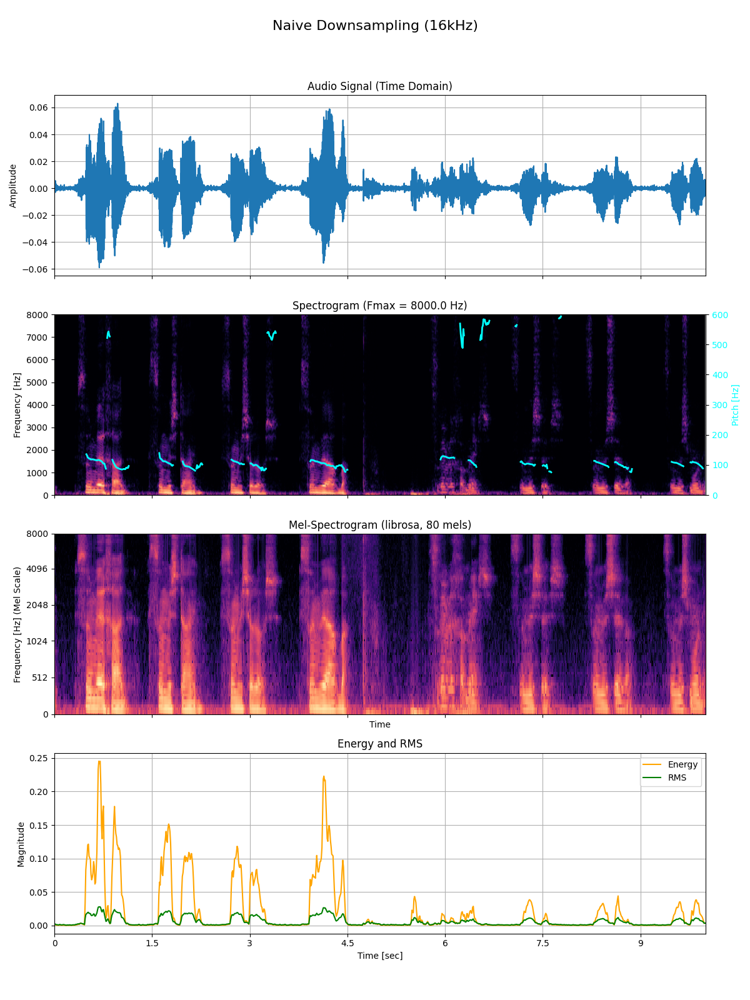
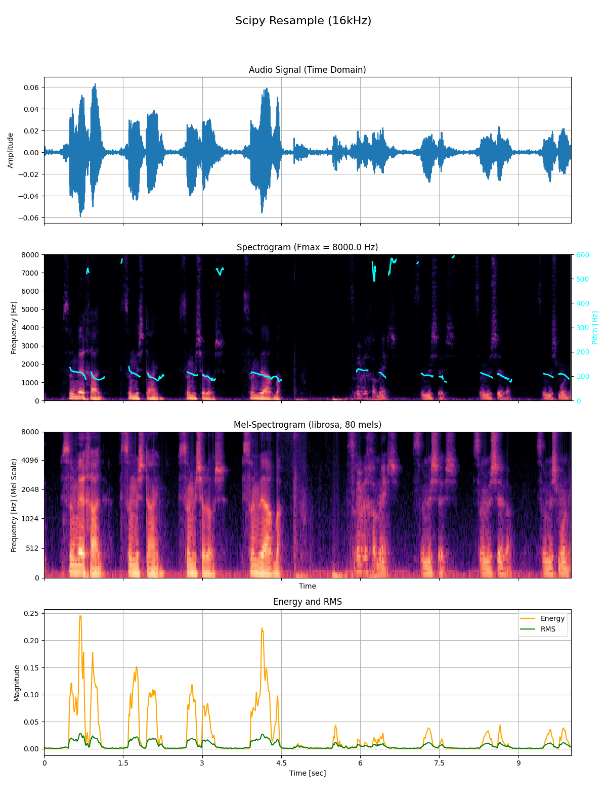
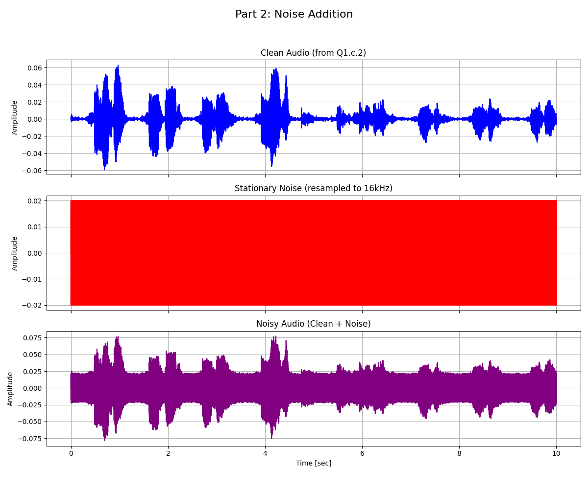
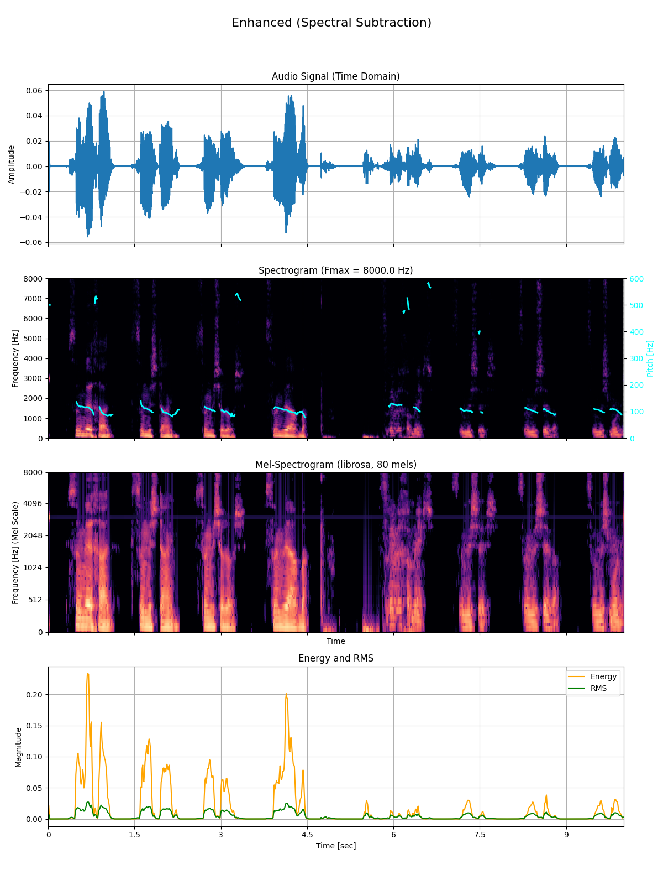
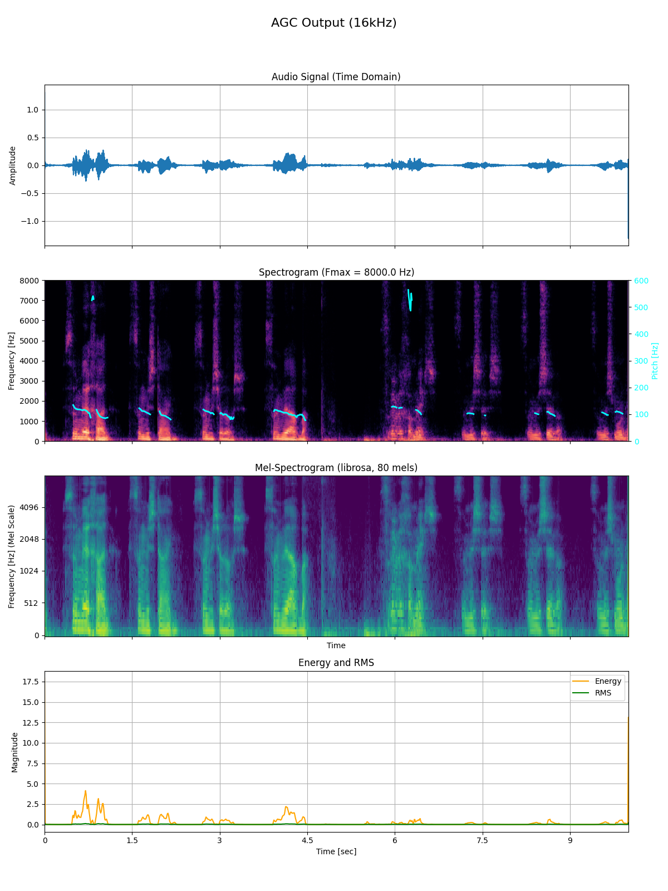
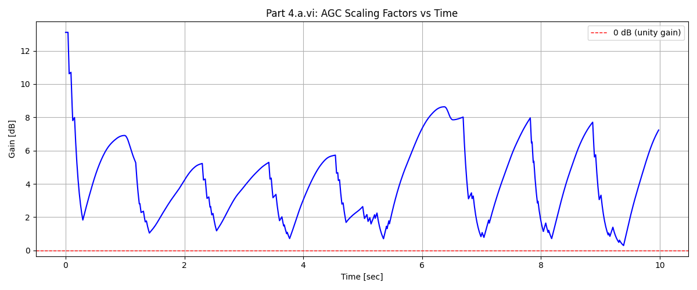
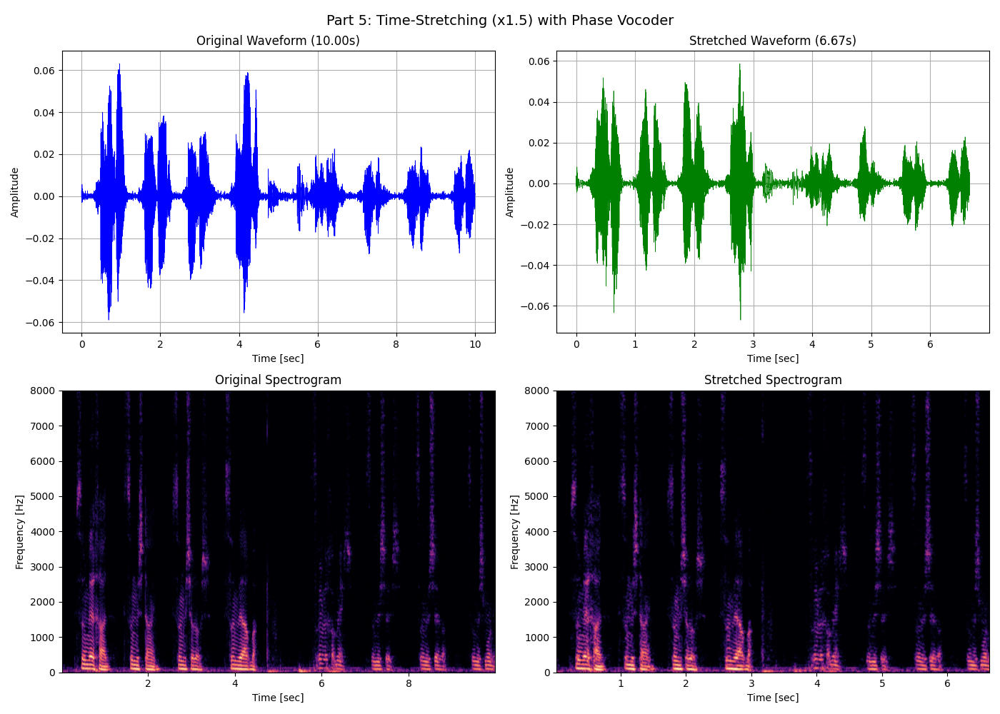

# Audio Processing - Assignment 1

Advanced Topics in Audio Processing using Deep Learning

---

## Project Structure

```
assignment1/
├── outputs/                # Generated outputs organized by part
│   ├── part1/
│   ├── part2/
│   ├── part3/
│   ├── part4/
│   ├── part5/
│   └── logs/
│       └── console_output.txt
├── main.py
├── part1/
│   ├── __init__.py
│   ├── loading.py          # load_audio()
│   ├── resampling.py       # resample_to_32k(), downsample_to_16k()
│   └── visualization.py    # plot_audio_analysis()
├── part2/
│   ├── __init__.py
│   └── noise.py            # load_and_resample_noise(), add_noise_to_audio(), plot_noise_addition()
├── part3/
│   ├── __init__.py
│   ├── vad.py              # compute_frame_energy(), compute_vad_mask(), plot_vad_threshold()
│   └── spectral_subtraction.py  # spectral_subtraction()
├── part4/
│   ├── __init__.py
│   └── agc.py              # compute_frame_rms_db(), compute_agc_gains(), apply_agc(), soft_clip_sigmoid(), plot_gain_curve()
├── part5/
│   ├── __init__.py
│   └── phase_vocoder.py    # stft(), istft(), phase_vocoder(), time_stretch_phase_vocoder(), plot_time_stretch_comparison()
├── 10-sec-gal.wav          # Recording (10 seconds)
└── stationary_noise.wav    # Noise file
```

---

## Setup

1. Install dependencies:
   ```bash
   pip install -r requirements.txt
   ```

2. Place your recording (`10-sec-gal.wav`) in the `assignment1/` directory.
   - **File Format:** Only `.wav` files are supported.
   - **Recording requirements:** 10 seconds total
     - 0-5 seconds: Speak ~20cm from the microphone
     - 5-10 seconds: Speak ~3m from the microphone

3. Run the assignment:
   ```bash
   cd assignment1
   python main.py
   ```

---

## Console Output

The full console output is saved to `outputs/logs/console_output.txt` for reference.

---

## Part 1: Audio Loading, Resampling, and Visualization

### Q1.a: Load the Audio File

**Implementation:** `part1/loading.py`

**i. If the audio was recorded in stereo, keep only a single channel.**

> ✅ **Answer:** The audio was detected as multi-channel (2 channels - stereo). We converted it to mono by keeping only the first channel.

**ii. What is the sampling frequency of the audio?**

> ✅ **Answer:** The native sampling frequency of the original audio is **44100 Hz**.

---

### Q1.b: Resample to 32kHz

**Objective:** Set the sampling rate of the signal to 32KHz using `scipy.signal.resample`.

**Implementation:** Used `scipy.signal.resample()` with `np.float32` casting.

---

### Q1.c: Downsample to 16kHz

**Objective:** Downsample the 32kHz audio to 16kHz using two different methods.

**Method 1 (Naive):** Take every even sample (index 0, 2, 4...).
```python
audio_16k_naive = audio_32k[::2]
```

**Method 2 (Scipy Resample):** Use `scipy.signal.resample` with anti-aliasing.
```python
audio_16k_resampled = scipy.signal.resample(audio_32k, num_samples_16k).astype(np.float32)
```

---

### Q1.d: Visualization Function

**Implementation:** `part1/visualization.py`

The function `plot_audio_analysis()` creates a figure with 4 subplots:

| Subplot | Description |
|---------|-------------|
| **i. Audio** | Time-domain waveform (x: time [sec], y: amplitude) |
| **ii. Spectrogram** | Frequency-domain representation with F_max validation and pitch contour overlay |
| **iii. Mel-Spectrogram** | Perceptual frequency scale (80 mel bands) |
| **iv. Energy and RMS** | Frame-level energy and RMS curves |

**Parameters:**
- Window size: **20ms** (320 samples @ 16kHz)
- Hop size: **10ms** (160 samples @ 16kHz)
- Window type: **Hamming**
- Mel filterbank: **80 mels**

**Q1.d.ii.1: Validate that you see F_max**

> ✅ **Answer:** The spectrogram Y-axis extends from 0 Hz to **8000 Hz** (Nyquist frequency = 16000/2 = 8000 Hz), confirming F_max is visible.

**Q1.d.ii.a: Why are there missing timeframes in the pitch contour?**

> ✅ **Answer:** Missing timeframes (gaps in the pitch line) occur because:
> 1. **Unvoiced segments:** Fricatives like /s/, /f/, /sh/ and more have no periodic structure
> 2. **Silence/pauses:** No speech activity in those frames
> 3. **Pitch detection threshold:** The algorithm requires a minimum harmonic strength to detect pitch reliably
> 4. **Background noise:** During distant speech (3m), the SNR may be too low for reliable pitch estimation

---

### Q1.e: Analysis and Comparison

**Which downsampling method is better?**

> ✅ **Answer:** They were almost the same, bit if we have to pick one so `scipy.signal.resample` method (Method 2) is slightly **superior**.

**Why?**

> ✅ **Answer:**
> - **Aliasing prevention:** Naive decimation (taking every 2nd sample) violates the Nyquist theorem if the signal contains frequencies above 8kHz. These high frequencies "fold back" into the audible range, causing distortion artifacts.
> - **Anti-aliasing filter:** `scipy.signal.resample` uses an FFT-based approach that inherently applies an anti-aliasing filter, preventing frequency folding.
> - **Practical impact:** In our recording, only ~1% of energy was above 8kHz, so aliasing artifacts are minimal. However, for recordings with more high-frequency content, the difference would be significant.

**Outputs:**
- `outputs/part1/audio_16k_naive.wav` - Naive downsampled audio
- `outputs/part1/audio_16k_resampled.wav` - Scipy resampled audio
- `outputs/part1/analysis_naive_downsampling.png` - Visualization (naive)
- `outputs/part1/analysis_scipy_resample.png` - Visualization (scipy)

#### Figures

**Naive downsampling (16kHz):**



**Scipy resample (16kHz):**



---

## Part 2: Adding Noise

### Q2.a: Load and Resample Noise

**Objective:** Load `stationary_noise.wav` and resample to 16kHz.

---

### Q2.b: Add Noise to Audio

**Objective:** Add noise to the audio from Q1.c.2 using the `+` operator.

**Implementation:**
```python
noisy_audio = audio_clean + noise_truncated
```


> ✅ **Answer:** The noise was longer than the audio (320000 vs 160000 samples), so we truncated the noise to match the audio length.

---

### Q2.c: Plot Noise Addition

**Objective:** Plot the audio, noise, and noisy audio signals.

**Outputs:**
- `outputs/part2/part2_noise_addition.png` - 3-subplot visualization
- `outputs/part2/audio_noisy.wav` - The noisy audio file

#### Figure



---

## Part 3: Spectral Subtraction

### Q3.a: Voice Activity Detection (VAD)

**Objective:** Find the speech parts using a threshold on the energy level.

**Implementation:** `part3/vad.py`

1. **Frame Energy Computation:** Compute energy per frame using vectorized framing (20ms window, 10ms hop)
   ```python
   energy = np.sum(frames ** 2, axis=1)
   ```

2. **Threshold Selection:** Used **40th percentile** of energy values
   ```python
   threshold = np.percentile(energy, 40.0)
   ```

3. **VAD Mask:** Frames with energy above threshold are classified as speech


> ✅ **Answer:** The threshold separates 599 speech frames from 400 noise frames, providing a good balance for noise estimation.

---

### Q3.b: Sequential Spectral Subtraction

**Objective:** For every time-frame, find its noise estimation ('noise footprint') and subtract it from the signal in a sequential manner.

**Implementation:** `part3/spectral_subtraction.py`

**Algorithm:**
1. **STFT:** Compute Short-Time Fourier Transform using Hann window (20ms, 10ms hop)
2. **Noise Buffer:** Maintain a fixed-size buffer (50 frames) of non-speech frame magnitudes
3. **Noise Estimation:** Average the noise buffer to get the "noise footprint"
4. **Spectral Subtraction Formula:**
   ```python
   enhanced_mag = max(mag - beta * noise_mag, floor * noise_mag)
   ```
   - `beta = 3.0` (aggressive 3x oversubtraction)
   - `floor = 0.001` (spectral floor to prevent musical noise)
5. **Reconstruction:** Overlap-add with original phase


---

### Q3.c: Plot Enhanced Audio

**Outputs:**
- `outputs/part3/part3_vad_threshold.png` - Energy contour with VAD threshold
- `outputs/part3/audio_enhanced.wav` - Enhanced audio after spectral subtraction
- `outputs/part3/analysis_enhanced.png` - Full visualization of enhanced audio

#### Figures

**VAD threshold over energy:**


**Enhanced audio analysis (spectral subtraction):**



---

## Part 4: Auto Gain Control (AGC)

### Q4.a.i: Determine the Desired RMS

**Objective:** Set the target RMS level for AGC normalization.

**Method:**
- Compute per-frame RMS in dB
- Identify speech frames (frames above noise floor)
- Set `desired_rms_db` as **75th percentile** of RMS over speech frames


> ✅ **Answer:** The desired RMS target is **-40.06 dB**.

---

### Q4.a.ii: Determine the Noise Floor Threshold

**Method:**
- Set `noise_floor_db` as **20th percentile** of RMS (global)
- Frames below noise floor will have gain limited to <= 0 dB (no amplification)

> ✅ **Answer:** The noise floor threshold is **-61.50 dB**.

---

### Q4.a.iii: Sequential Gain Computation

**Objective:** For every time-frame, find its relevant gain and amplify/attenuate accordingly using statistics based on a window of ~1s.

**Implementation:** `part4/agc.py`

**Algorithm:**
1. **Running Statistics Window:** Ring buffer of ~100 frames (~1s at 10ms hop)
2. **Target Gain Calculation:**
   ```python
   target_gain_db = desired_rms_db - running_rms_median_db
   ```
3. **Noise Floor Gating:** If frame RMS < noise floor, limit gain to <= 0 dB (don't amplify noise)
4. **Attack/Release Smoothing:** Exponential smoothing with:
   - Attack coefficient: 0.1 (fast attack)
   - Release coefficient: 0.01 (slow release)

> ✅ **Answer:** Gains ranged from **0.30 dB to 13.11 dB**, with higher gains applied to quiet (distant) speech segments.

---

### Q4.a.iv: Overflow Prevention (Soft Clipping)

**Objective:** Avoid clipping after gain application using a sigmoid function.

> ✅ **Answer:** The AGC amplification caused peak amplitudes to reach **121.47** (massive overflow!). The soft clipping function reduced this to **1.31**, preserving the waveform shape while preventing hard clipping artifacts.

---

### Q4.a.v: Plot AGC Output

**Objective:** Visualize the AGC-processed audio using the function from Q1.d.

---

### Q4.a.vi: Plot Scaling Factors vs Time

**Objective:** Plot the AGC gain curve over time.

**Outputs:**
- `outputs/part4/audio_agc.wav` - AGC-processed audio
- `outputs/part4/part4_agc_gains.png` - Gain (dB) vs time plot
- `outputs/part4/analysis_agc_output.png` - Full visualization of AGC output

#### Figures

**AGC output analysis:**



**AGC gain curve (dB) vs time:**



> ✅ **Observation:** The gain curve shows higher gains (~10-13 dB) applied during the second half of the recording (5-10s) when the speaker was 3m from the microphone, and lower gains (~0-5 dB) during the first half when close to the microphone.

---

## Part 5: Time-Stretching with Phase Vocoder

### Q5.a: Overview

**Objective:** Increase the speed of the audio from Q1.c.2 by a factor of **x1.5** while **preserving the pitch** using a phase vocoder algorithm.

---

### Q5.a.i: Input/Output Mapping

**Objective:** Set the mapping between the input and output.

**Method:** Fixed monotonic mapping for rate=1.5 (speed up)

> ✅ **Answer:** For 1.5x speedup, output frame 0 maps to input frame 0, output frame 1 maps to input frame 1.5, etc. We interpolate between adjacent input frames.

---

### Q5.a.ii: Apply STFT

**Objective:** Compute Short-Time Fourier Transform on the input audio.

**Parameters:**
- Window: **Hann** (optimal for OLA reconstruction)
- Window size: **40ms** (640 samples @ 16kHz)
- Hop size: **10ms** (160 samples)
- Overlap: **75%**

> ✅ **Answer:** The STFT produced **997 frames** with **321 frequency bins** (N_FFT/2 + 1).

---

### Q5.a.iii: Magnitude and Phase Computation

**Objective:** Calculate the magnitude and phase values of the output STFT.

**Phase Vocoder Algorithm:**
1. **Magnitude Interpolation:** Linearly interpolate magnitudes between adjacent frames
2. **Phase Accumulation:** Use instantaneous frequency estimation

> ✅ **Answer:** The phase vocoder reduced frames from **997 → 665** (997/1.5 ≈ 665), achieving the 1.5x speedup.

---

### Q5.a.iv: Apply iSTFT

**Objective:** Reconstruct time-stretched audio from the modified STFT.

**Method:**
1. Inverse rFFT per frame
2. Apply synthesis window (Hann)
3. Overlap-add reconstruction
4. Normalize by squared window sum
5. RMS normalization to match original loudness

> ✅ **Answer:** The time-stretched audio is **6.67 seconds** (10s / 1.5 = 6.67s), with pitch preserved. RMS normalization applied a **1.42x gain** to compensate for volume reduction during processing.

---

### Q5.a.v: Plot Signals

**Objective:** Plot the signals in the time domain and spectral domain.

**2x2 subplot figure:**
- Top-left: Original waveform (10.00s)
- Top-right: Stretched waveform (6.67s)
- Bottom-left: Original spectrogram
- Bottom-right: Stretched spectrogram

**Outputs:**
- `outputs/part5/audio_speedx1p5.wav` - Time-stretched audio
- `outputs/part5/part5_time_stretch.png` - Time and spectral domain comparison

#### Figure



> ✅ **Observation:** The spectrograms show that the **pitch (harmonic structure) is preserved** while the **time duration is compressed** by 1.5x. The frequency content remains identical, confirming successful pitch-preserving time stretching.

---

### Quality Improvements

Phase vocoders can produce "metallic" or "phasey" artifacts. The following improvements were applied:

| Parameter | Initial | Improved | Reason |
|-----------|---------|----------|--------|
| Window size | 20ms | **40ms** | Better frequency resolution reduces smearing |
| Overlap | 50% | **75%** | Smoother transitions between frames |
| Window type | Hamming | **Hann** | Better sidelobe suppression for OLA |
| Phase logic | Simple diff | **Instantaneous frequency** | Proper phase coherence |
| Volume | Unnormalized | **RMS Normalized** | Fixes low volume after time-stretching |

---

## Summary

| Part | Key Outputs |
|------|-------------|
| **Part 1** | Resampled audio (44100→32000→16000 Hz), visualization plots |
| **Part 2** | Noisy audio with added stationary noise |
| **Part 3** | Enhanced audio via spectral subtraction |
| **Part 4** | AGC-processed audio with normalized loudness |
| **Part 5** | 1.5x time-stretched audio with preserved pitch |

All outputs are saved to the `outputs/` directory, organized by part.
